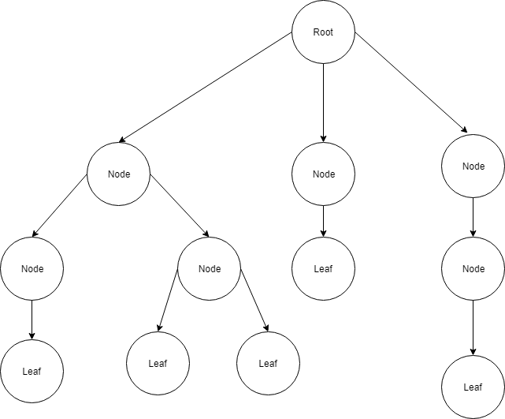

# Aeviiq Tree Node

A library that provides the tree node functionality.

## Installation
```
composer require aeviiq/tree-node
```

## Declaration
```php
// ...
use Aeviiq\TreeNode\TreeNodeTrait;

final class Foo implements FooBarInterface
{
    use TreeNodeTrait;
    
    // ...
}
```

Will provide the Foo class with the functionality to support the tree node structure:




## Usage
```php
$foo = new Foo();
$foo2 = new Foo();
$foo->addChild($foo2);

$foo->isRoot(); // true
$foo2->isRoot(); // false

$foo->isLeaf(); // false
$foo2->isLeaf(); // true
$foo2->getRoot() === $foo; // true
```

## Notable mentions
*There is no 'protection' against the case where a node can become it's own grand parent|child. 
When this is the case, it could cause infinite recursion errors in methods such as getRoot(). 
Making a node its own grand parent or grand child is just a plain wrong usage of this tree node component,
therefor it is not worth the performance decrease to recursively validate against.
